# F# Language Server
This project is an implementation of the [language server protocol](https://microsoft.github.io/language-server-protocol/) using the [F# Compiler Service](https://fsharp.github.io/FSharp.Compiler.Service/).

This has been forked from GeorgeWfraser's orginal project because that appears to be unmaintained.
It has been updated to support fcs 41 and net6.0
I have used code from FSharpAutoComplete and some adjustments to the original to add some features
- Better hover docs
- working documentation for system types
- semantic tokenization

## Now the original descritption


## Features

### Hover
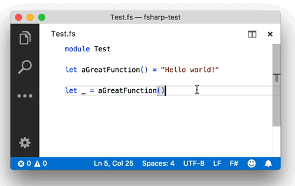

### Autocomplete
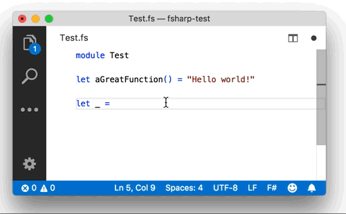

### Method signature help
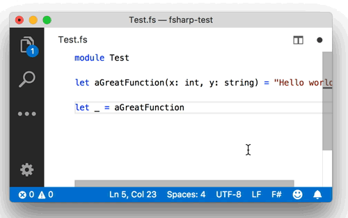

### Find symbols in document
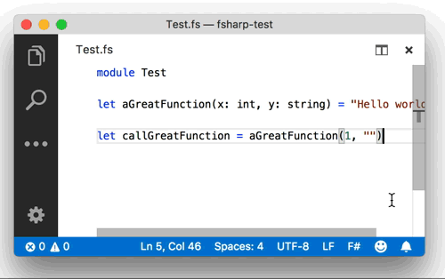

### Find symbols in workspace
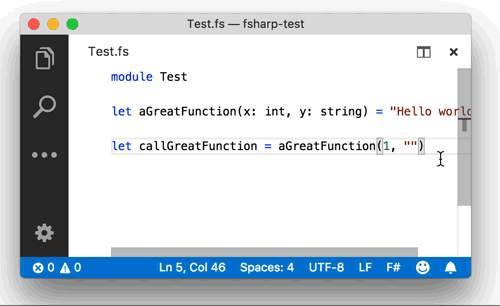

### Go-to-definition
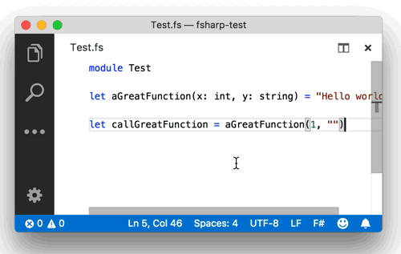

### Find references
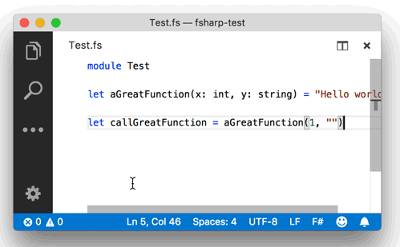

### Rename symbol
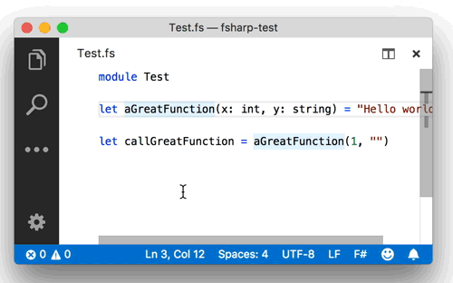

### Show errors on save
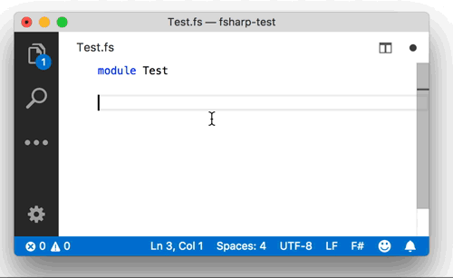

### Run & Debug tests
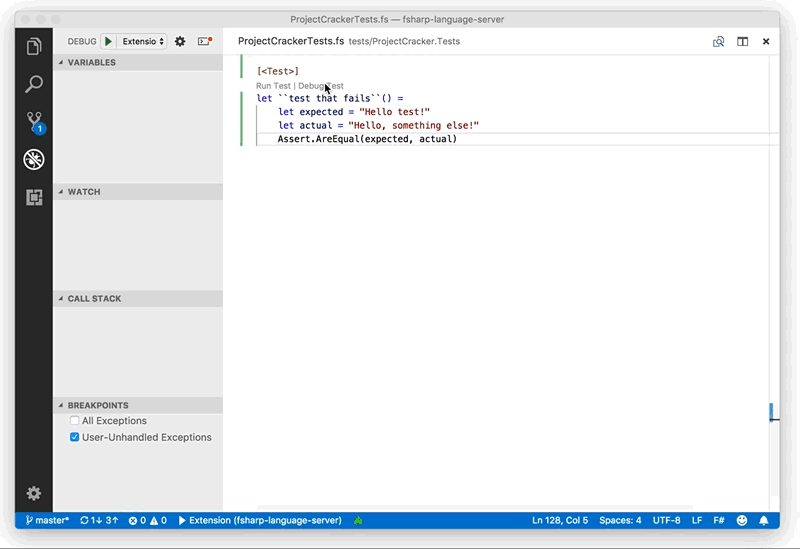

## Code structure
The language server protocol (LSP) is very similar to the API defined by the F# compiler service (FCS); most of the implementation is devoted to translating between the types used by FCS and the JSON representation of LSP.

- client/extension.ts: Client-side VSCode launcher
- sample: Example projects used by tests
- scripts: Scripts for building and testing
- src/LSP: Server-side implementation of [language server protocol](https://microsoft.github.io/language-server-protocol/specification)
- src/ProjectCracker: Figures out [F# compiler options](https://docs.microsoft.com/en-us/dotnet/fsharp/language-reference/compiler-options) using [Buildalyzer](https://github.com/daveaglick/Buildalyzer) and the MSBuild API.
- src/FSharpLanguageServer: F# language server
- tests/LSP.Tests
- tests/ProjectCracker.Tests
- tests/FSharpLanguageServer.Tests
- videos: Animated GIFs on this page

## Installation

### VSCode
[Install from the VSCode extension marketplace](https://marketplace.visualstudio.com/items?itemName=georgewfraser.fsharp-language-server)

### Vim
Clone this repo to your system and build it:

```
npm install
dotnet build -c Release
```

If using a distribution based on Arch Linux, you can also install it from the [AUR](https://aur.archlinux.org/packages/fsharp-language-server/)

Install [LanguageClient-neovim](https://github.com/autozimu/LanguageClient-neovim) 

Update your vim config to point LanguageClient-neovim to the FSharp Language Server for fsharp filetypes:
```
let g:LanguageClient_serverCommands = {
    \ 'fsharp': ['dotnet', '/Users/name/code/fsharp-language-server/src/FSharpLanguageServer/bin/Release/netcoreapp3.0/target/FSharpLanguageServer.dll']
    \ }
```
Open an fsharp file, move the cursor, and call functions. Mappings are up to you:
* Hover `call LanguageClient#textDocument_hover()`
* Rename: `call LanguageClient#textDocument_rename()`
* Definition: `call LanguageClient#textDocument_definition()`
* etc...

Neovim with Deoplete completion:\
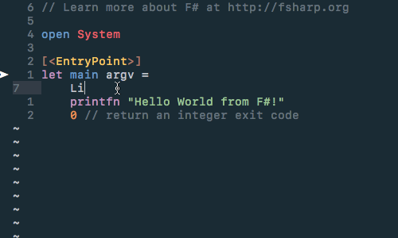

(alternatively there is another vim language server plugin [vim-lsp](https://github.com/prabirshrestha/vim-lsp) but this one hasn't been tried.

### Emacs

#### Spacemacs

Clone this repo to your system and build it:

```
npm install

# Pick the appropriate target based upon your OS 
dotnet publish -c Release -r linux-x64 src/FSharpLanguageServer
dotnet publish -c Release -r osx.10.11-x64 src/FSharpLanguageServer
dotnet publish -c Release -r win10-x64 src/FSharpLanguageServer
```

Make sure that the FSharpLanguageServer (in `src/FSharpLanguageServer/bin/Release/netcoreapp3.0/PLATFORM/publish`) is in your PATH. Alternatively, you can set the path to the server executable manually within your .spacemacs user-config:

```
(setq fsharp2-lsp-executable "/path/to/FSharpLanguageServer")
```

Since the stock fsharp layer does not currently include LSP support, you will need to use the fsharp2 layer (a fork of fsharp) which does. To use fsharp2, copy the custom layer into your Spacemacs private layers directory. In order for this layer to work, you must be on the Spacemacs **develop** branch, since the LSP layer is not yet available in Spacemacs master.

```
cp -r spacemacs/fsharp2 ~/.emacs.d/private
```

Finally, make sure that you have these layers enabled in your dotspacemacs-configuration-layers. You will need to remove the fsharp layer if you have it, since fsharp2 conflicts with it.

- lsp 
- fsharp2 
- syntax-checking
- auto-completion

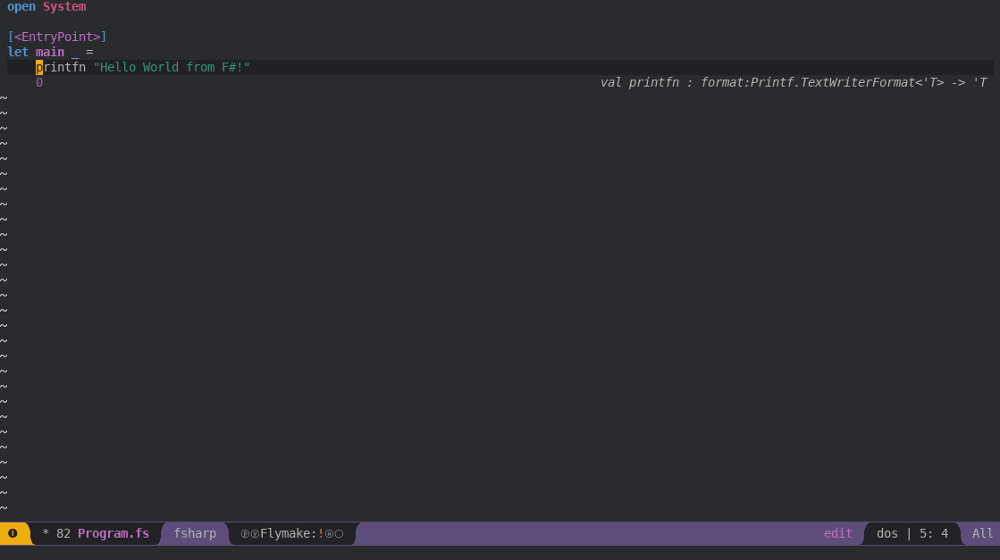

## How is this project different than [Ionide](https://github.com/ionide)?
Ionide is a suite of F# plugins for VSCode; F# language server is analagous to the [FSAC](https://github.com/fsharp/FsAutoComplete) component.

The implementation is a thin wrapper around [F# Compiler Service](https://fsharp.github.io/FSharp.Compiler.Service/) and is heavily focused on performance. For example, autocompleting in medium-sized file in F# Language Server (left) and Ionide (right):

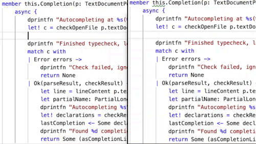
